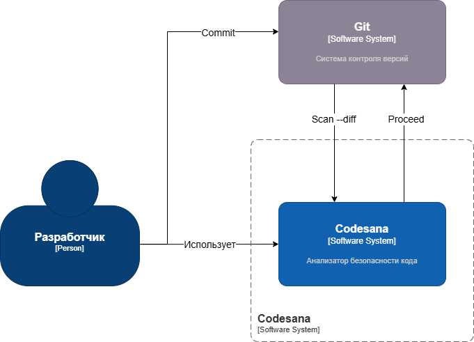
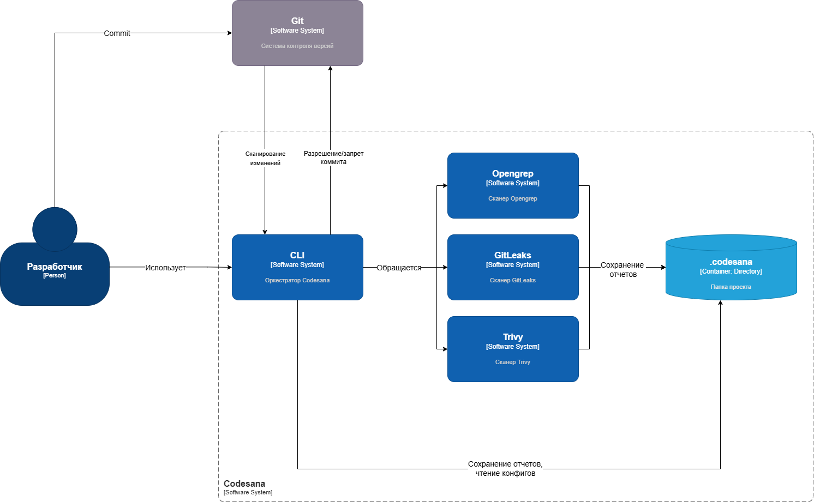
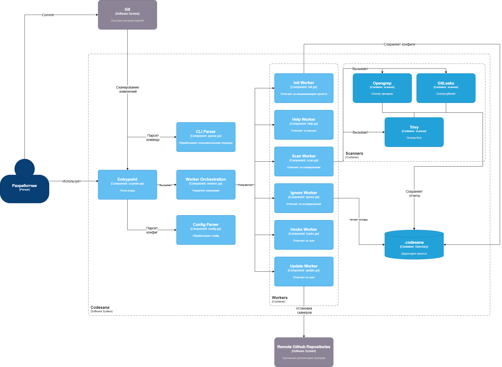

# 🚀 Codesana v0.5

Codesana — CLI-инструмент для статического анализа безопасности кода (SAST + SCA + secrets scanning) с поддержкой Git-интеграции, ignore-правил и генерации отчётов.

---

## ✨ Возможности

### 🔍 Сканирование уязвимостей

- OpenGrep (SAST анализ кода)
- Trivy (CVE и уязвимости зависимостей)
- GitLeaks (поиск секретов и токенов)

---

### 🌿 Git-интеграция

- Сканирование всего проекта
- Режим `--diff` (только изменения в коммите)
- Pre-commit hooks для автоматической проверки

---

### 🚫 Ignore система

- Игнорирование найденных уязвимостей по хешу
- Поддержка причин игнорирования
- Локальное хранение исключений

---

### 📦 Управление инструментами

- Автоматическая установка сканеров
- Обновление бинарников через `codesana update`
- Поддержка Windows / Linux / macOS

---

### 📊 Отчёты

- Цветной консольный вывод severity
- Генерация PDF отчётов
- Сводка:
    - Critical
    - High
    - Medium
    - Low

---

## Архитектура

### C4 - Context



### C4 - Container



### C4 - Component



---

### ⚙️ CLI команды

```bash
codesana init
codesana scan
codesana scan --diff
codesana ignore <hash>
codesana hooks install
codesana hooks remove
codesana update
codesana help
```
